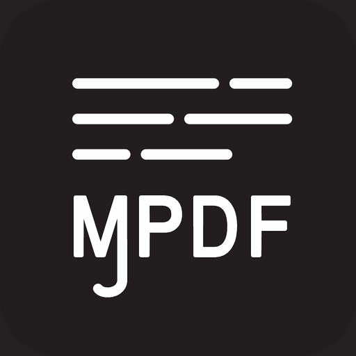

<div align="center">



# MJ PDF

A PDF reader for Android that does everything, stays fast, and never phones home.

[](LICENSE)
[](change_log.md)
[](https://developer.android.com/about/versions/marshmallow)
[](https://apt.izzysoft.de/fdroid/index/apk/com.gitlab.mudlej.MjPdfReader)

<a href="https://apt.izzysoft.de/fdroid/index/apk/com.gitlab.mudlej.MjPdfReader"></a>

</div>

Most PDF apps make you choose. The light ones can barely turn pages. The capable ones are bloated, closed, and full of trackers. I wanted one app that reads, organizes, highlights, and signs, in a few megabytes, with nothing spying on you. That app did not exist, so I built it.

MJ PDF started in 2022 as a fork of the discontinued PDF Viewer Plus and has been downloaded more than 150,000 times since. Along the way I rewrote most of it and went as deep as rebuilding the PDF engine itself. Version 3.0 is the largest release so far: a full library manager, highlighting, handwritten signatures, form filling, and a rendering stack that is faster than it has ever been.

## Screenshots

| Home | Light | Dark | Menu |
|:-:|:-:|:-:|:-:|
|  |  |  |  |

More in the [screenshots folder](screenshots/).

## What it does

**Your library, not just a file picker.** The app opens to a Home screen with three tabs. Recent shows what you are reading and how far you got. Library organizes everything by reading status, as covers or a list. Folders is a real file browser with breadcrumbs and SD card support. Books are identified by their content, so your progress survives moving, renaming, and re-downloading files. A search bar finds any PDF on the device, even ones you never opened.

**A reader that gets out of the way.** True edge-to-edge fullscreen. Every toolbar, shortcut, and fullscreen button is configurable with drag and drop. Dark mode applies to the PDF itself, not just the chrome. Auto-scroll at a speed the app remembers per book. Margins can be cropped away so the text fills your screen. Right-to-left books are detected and paged correctly.

**Real annotation, saved into the file.** Highlights and handwritten signatures are written into the PDF itself, so they open in any other reader. Signatures are vector strokes that stay sharp at any zoom, and the app remembers your signature for the next document. Forms can be filled directly. If the app dies with unsaved work, autosave recovery brings it back.

**Search that keeps up.** Results stream in while the scan runs, and the scan keeps going in the background after you jump to a result. A small bar in the reader steps through matches with a live counter. Search sessions are cached, so asking the same question twice is instant.

**Navigation like a browser.** Back and forward through your jump history. Bookmarks with your own names. Both show the chapter you were in, pulled from the table of contents. Internal links offer a jump back that restores the exact view you left.

**Text Mode.** Any PDF becomes an e-book: reflowed text, your choice of font, size, theme, and line length. Page position stays in sync with the PDF view.

**And the basics done right.** Password-protected files, online PDFs by link, sharing, printing, multiple windows, mouse and volume-key controls, backup and restore of all your data.

## Privacy

MJ PDF collects nothing. There are no analytics, no ads, and no network calls behind your back.

Two permissions, two reasons:

| Permission | Used for |
|---|---|
| Internet | Opening PDFs from links you paste |
| Storage / all-files access | Scanning, opening, and managing the PDFs on your device |

Exodus lists one "tracker": ACRA, the open source crash reporter. It sends nothing on its own. When the app crashes you get a dialog showing exactly what would be reported, and nothing leaves your device unless you press SEND. I read those reports to fix crashes, that is all they are for. The configuration is [in the code](app/src/main/java/com/gitlab/mudlej/MjPdfReader/App.kt) if you want to check.

## Why it is fast

This is the part I am most proud of, because it required going below the app layer.

Android PDF apps almost all render through PDFium, Chrome's PDF engine, using prebuilt binaries that upstream compiles optimized for file size, not speed. That single compiler flag made rendering measurably slower for years, in every app that used those binaries. MJ PDF now builds PDFium from source, optimized for performance, along with its own FreeType and libpng. One script does the whole build reproducibly.

On top of that engine sits a rendering pipeline I keep tuning by hand:

- Pinch zoom renders whole-page snapshots during the gesture instead of a patchwork of tiles.
- Pages re-render in steps while you pinch, not just when you let go.
- The tile cache works on a fixed pixel budget and evicts genuinely stale tiles first.
- Heavy work (scanning, hashing, covers, text extraction) never touches the UI thread.

The result is a reader that stays smooth on huge documents while the APK stays small.

## Building

```sh
git clone https://gitlab.com/mudlej_android/mj_pdf_reader.git
cd mj_pdf_reader
./gradlew assembleDebug
```

That is enough for the app itself, since prebuilt native libraries are included. To go deeper:

- [SETUP.md](SETUP.md) walks through a complete environment from a fresh Linux install.
- The scripts in [build_dependencies](build_dependencies/) rebuild the native stack: PDFium (prebuilt or fully from source), FreeType, libpng, and the JNI bridge.
- After editing `mainJNILib.cpp`, run `ndk-build` in `PdfiumAndroid/src/main/jni`.

The repository is three modules:

| Module | Role |
|---|---|
| `app` | The MJ PDF application (Kotlin) |
| `AndroidPdfViewer` | My fork of barteksc's viewer: rendering view, gestures, text selection, highlights |
| `PdfiumAndroid` | My fork of the PDFium JNI bindings, updated to a current engine |

## Contributing

- **Bugs and ideas**: open an issue on [GitHub](https://github.com/mudlej/mj_pdf/) or [GitLab](https://gitlab.com/mudlej_android/mj_pdf_reader).
- **Translations**: the app speaks 13 languages (Arabic, Chinese, Dutch, French, German, Hindi, Italian, Persian, Polish, Portuguese, Russian, Spanish, Turkish). To add or improve one, edit `app/src/main/res/values-<lang>/strings.xml` and open a merge request.
- **Code**: merge requests are welcome. The [changelog](change_log.md) and [todo list](todo.md) show where the project is heading.

## Where to get it

- [IzzyOnDroid](https://apt.izzysoft.de/fdroid/index/apk/com.gitlab.mudlej.MjPdfReader). The easiest way to install it and stay up to date is through [Droid-ify](https://droidify.app/).
- [Direct APK from GitLab releases](https://gitlab.com/mudlej_android/mj_pdf_reader/-/releases)
- F-Droid main repo: stuck in review since 2022. Auditing PDFium's full dependency tree is genuinely hard.
- Play Store: MJ PDF lived there for three years with tens of thousands of active users, until Google [suspended the developer account](https://github.com/mudlej/mj_pdf/issues/46) without a verifiable reason. It may return one day.

## History and credits

MJ PDF began as a continuation of [PDF Viewer Plus](https://github.com/chxp82q/PdfViewer) by Gokul Swaminathan ([@JavaCafe01](https://github.com/JavaCafe01)). After MJ PDF launched, he discontinued his app and [recommended MJ PDF](https://github.com/chxp82q/PdfViewer/commit/3b26b86053d9756b3ae7085b033cf35460b1db74) as its replacement.

- [@barteksc](https://github.com/barteksc) wrote the original viewer and JNI libraries this project forked.
- [@Derekelkins](https://github.com/Derekelkins) added remember-last-page to the original app.
- [Bnyro](https://gitlab.com/Bnyro) (LibreTube) helped with the Material 3 migration.
- Community translators brought the app to 13 languages.

## License

[GPLv3](LICENSE). The original PDF Viewer Plus was MIT licensed.
